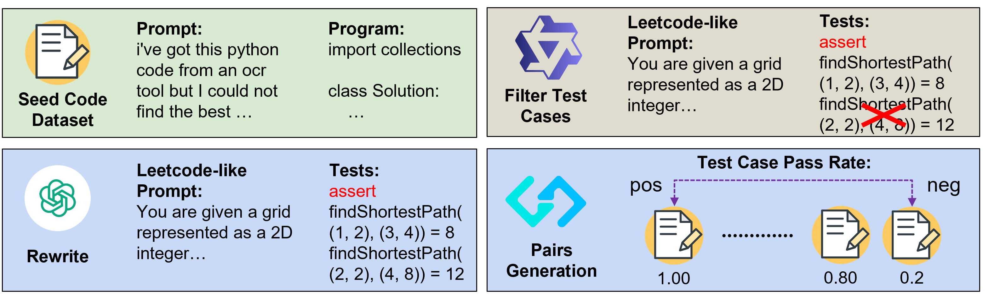

# 🂡 AceCoder

<a target="_blank" href="https://github.com/TIGER-AI-Lab/AceCoder/blob/main/assets/pdf/acecoder_v1.pdf">
</a>
<a target="_blank" href="https://github.com/TIGER-AI-Lab/AceCoder">
</a>
<a target="_blank" href="https://tiger-ai-lab.github.io/AceCoder/">
</a>
<a target="_blank" href="https://huggingface.co/datasets/TIGER-Lab/AceCode-89K">
</a>
<a target="_blank" href="https://huggingface.co/collections/TIGER-Lab/acecoder-67a16011a6c7d65cad529eba">
</a>
<!-- <a target="_blank" href="https://twitter.com/DongfuJiang/status/1805438506137010326">
</a> -->
<br>


<span style="color:#183385; font-size: 14pt; font-family: Roboto, Helvetica, Arial, Heveltica Neue, sans-serif">
     <b>Authors:</b>
     <a class="name" target="_blank" href="https://www.wyett-zeng.com/about.html">Huaye Zeng</a>, 
     <a class="name" target="_blank" href="https://jdf-prog.github.io/">Dongfu Jiang</a>, 
     <a class="name" target="_blank" href="#">HaoZhe Wang</a>,
     <a class="name" target="_blank" href="#">Ping Nie</a>,
     <a class="name" target="_blank" href="#">Xiaotong Chen</a>,
     <a class="name" target="_blank" href="https://wenhuchen.github.io/">Wenhu Chen</a>&nbsp; @ 
     <a class="btna" target="_blank" href="https://huggingface.co/TIGER-Lab">TIGER-Lab</a> &nbsp; 
     </span>

## 🔥News

- [2025/2/3] We release the [AceCoder Paper](https://github.com/TIGER-AI-Lab/AceCoder/blob/main/assets/pdf/acecoder_v1.pdf), along with the [🤗 Models and Datasets](https://huggingface.co/collections/TIGER-Lab/acecoder-67a16011a6c7d65cad529eba) on Hugging Face. 


## Overview


<details><summary>Abstract</summary> 

- We introduce AceCoder, the first work to propose a fully automated pipeline for synthesizing large-scale reliable tests used for the reward model training and reinforcement learning in the coding scenario. To do this, we curated the dataset [AceCode-89K](https://huggingface.co/datasets/TIGER-Lab/AceCode-89K), where we start from a seed code dataset and prompt powerful LLMs to "imagine" proper test cases for the coding question and filter the noisy ones.

- We trained two reward model [AceCodeRM-7B](https://huggingface.co/TIGER-Lab/AceCodeRM-7B) and [AceCodeRM-32B](https://huggingface.co/TIGER-Lab/AceCodeRM-32B) on the constructed [preference pairs](https://huggingface.co/datasets/TIGER-Lab/AceCodePair-300K). Best-of-N sampling results on HumanEval(+), MBPP(+), BigCodeBench, LiveCodeBench (V4) show consistent improvement.

- We perform RL training from three policy models: Qwen2.5-7B-Instruct and Qwen2.5-Coder-7B-Base and Qwen2.5-Coder-7B-Instruct. Two types of reward can be used, i.e. the trained reward model RM-7B and the rule-based reward, i.e. binary pass rate over the test cases in dataset. Additionaly, we also experiment with RL from the base model like DeepSeek-R1. Results show that directly RL from the Base Qwen2.5-Coder model can get **25%** improvement on HumanEval-plus and **6%** on MBPP-plus within just **80** optimization steps.

- To our knowledge, this is the first work to propose a fully automated pipeline for synthesizing large-scale reliable tests used for the reward model training and reinforcement learning in the coding scenario. We believe our \dataset{} will unlock the potential of RL training for code generation models and help the community to further push the boundaries of LLM's coding abilities.

</details>

## 📚Dataset
- [AceCode-89K](https://huggingface.co/datasets/TIGER-Lab/AceCode-89K): The first large-scale coding dataset with an average of 16 test cases per prompt, synthesized by GPT-4o-mini
- [AceCodePair-300K](https://huggingface.co/datasets/TIGER-Lab/AceCodePair-300K): Constructed preference pairs from AceCode-89K for training reward model.
- AceCode-89K-hard: where you can create sample 25% of the hard examples via this [script](#)

## 🤗Model

### AceCodeRM (Reward Model)
- [AceCodeRM-7B](https://huggingface.co/TIGER-Lab/AceCodeRM-7B): A reward model trained on AceCodePair-300K from Qwen2.5-Coder-7B-Instruct
- [AceCodeRM-32B](https://huggingface.co/TIGER-Lab/AceCodeRM-32B): A reward model trained on AceCodePair-300K from Qwen2.5-Coder-32B-Instruct

### AceCoder (RL Model)
| Initial Policy Model | Reward Type | Training dataset | Final RL Model |
|:---------------------:|:-----------:|:----------------:|:--------------:|
| Qwen2.5-7B-Instruct   | AceCodeRM-7B      | AceCode-89K-hard (22k)      | [TIGER-Lab/AceCoder-Qwen2.5-7B-Ins-RM](https://huggingface.co/TIGER-Lab/AceCoder-Qwen2.5-7B-Ins-RM) |
| Qwen2.5-7B-Instruct   | Rule      | AceCode-89K-hard (22k)      | [TIGER-Lab/AceCoder-Qwen2.5-7B-Ins-Rule](https://huggingface.co/TIGER-Lab/AceCoder-Qwen2.5-7B-Ins-Rule) |
| Qwen2.5-Coder-7B-Instruct   | AceCodeRM-7B      | AceCode-89K-hard (22k)      | [TIGER-Lab/AceCoder-Qwen2.5-Coder-7B-Ins-RM](https://huggingface.co/TIGER-Lab/AceCoder-Qwen2.5-Coder-7B-Ins-RM) |
| Qwen2.5-Coder-7B-Instruct   | Rule      | AceCode-89K-hard (22k)      | [TIGER-Lab/AceCoder-Qwen2.5-Coder-7B-Ins-Rule](https://huggingface.co/TIGER-Lab/AceCoder-Qwen2.5-Coder-7B-Ins-Rule) |
| Qwen2.5-Coder-7B   | AceCodeRM-7B      | AceCode-89K-hard (22k)      | [TIGER-Lab/AceCoder-Qwen2.5-Coder-7B-Base-RM](https://huggingface.co/TIGER-Lab/AceCoder-Qwen2.5-Coder-7B-Base-RM) |
| Qwen2.5-Coder-7B   | Rule      | AceCode-89K-hard (22k)      | [TIGER-Lab/AceCoder-Qwen2.5-Coder-7B-Base-Rule](https://huggingface.co/TIGER-Lab/AceCoder-Qwen2.5-Coder-7B-Base-Rule) |

## 📈 Performance
See our [website](https://tiger-ai-lab.github.io/AceCoder/) or paper for detailed performance report.

## 🚀Quick Start

```bash
git submodule init
git submodule update
```

### Training Reward Model
(TODO)

### Training RL Model
See [train/train_rl/README.md](train/train_rl/README.md) for detailed instructions.

### Evaluation
We use [Evalplus](https://github.com/evalplus/evalplus), [bigcodebench](https://github.com/bigcode-project/bigcodebench), [LiveCodeBench](https://github.com/LiveCodeBench/LiveCodeBench) for evaluation of HumanEval(+), MBPP(+), BigCodeBench, LiveCodeBench (V4) respectively.

## Citation
If you find this work helpful, please consider citing:
```bibtex
@article{AceCoder,
    title={AceCoder: Acing Coder RL via Automated Test-Case Synthesis},
    author={Zeng, Huaye and Jiang, Dongfu and Wang, Haozhe and Nie, Ping and Chen, Xiaotong and Chen, Wenhu},
    journal={ArXiv},
    year={2025},
    volume={}
}
```
